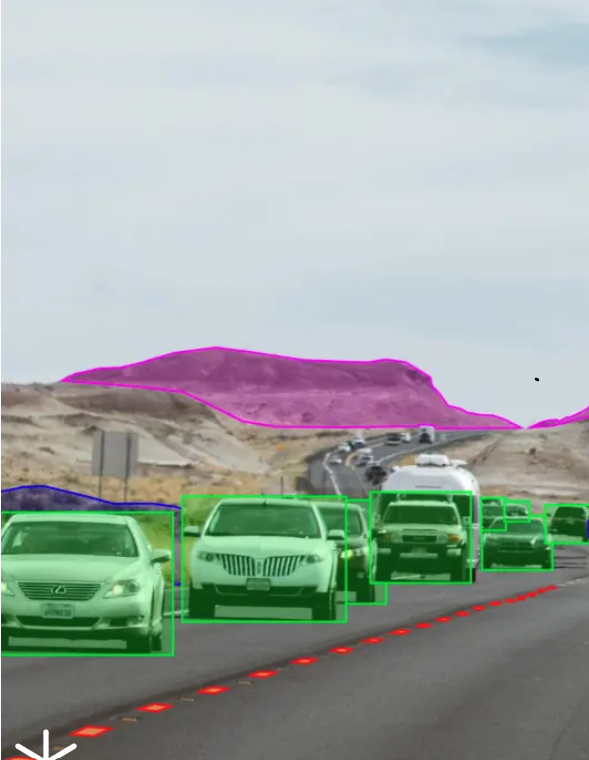
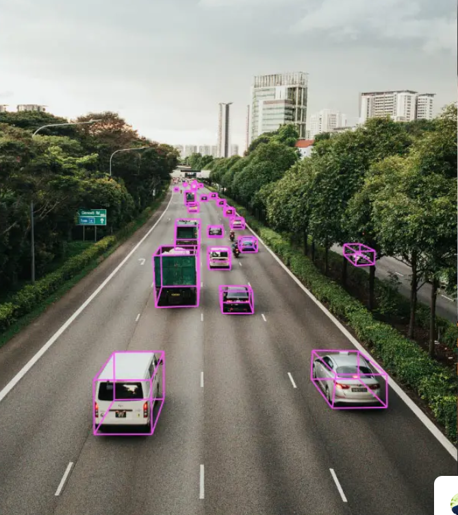
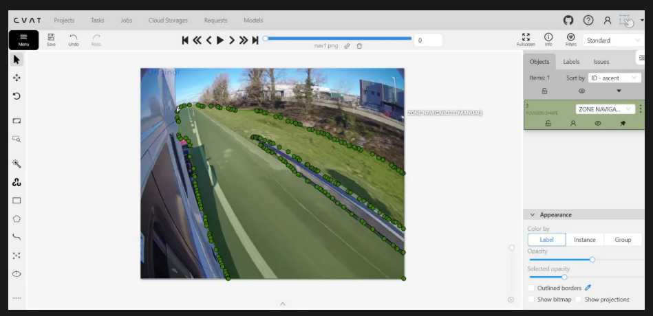

 
## Professional Summary
Entry-level Software Engineer with a strong academic background in Computer Science and hands-on experience through internships and academic projects. Skilled in Python and Java with foundational knowledge in machine learning and deep learning. Passionate about building reliable software solutions and continuously improving technical skills.

## Education
 
Master of Science in Computer Science.

Auburn University at Montgomery (AUM), USA. 

Bachelor of Computer Applications (BCA).

SASTRA University, Chennai, India.

## Technical Skills
Python | Java | C | C++ | JavaScript | HTML | CSS | MySQL | Git | GitHub | Neural Networks | Deep Learning Basics | Linux

## Professional Experience

# HCL Technologies

Software Engineer | Sep 2019 – 2024

Promoted from Software Engineering Intern after demonstrating proficiency in programming, testing, and regulatory workflows.

Key Projects:

BDMMS – CMPH (Becton Dickinson Medical Management System).    

•	Served as Software Engineer and Product Regulatory Analyst on a medical device compliance project.

•	Managed medical device complaints and supported end-to-end regulatory workflows.

•	Created and reviewed Medical Device Reports (MDRs) in accordance with FDA and project requirements.

•	Conducted quality check analysis to ensure data accuracy, consistency, and compliance.

•	Utilized TrackWise and SAP for complaint handling, reporting, and quality management.

•	Collaborated with cross-functional teams to meet quality standards and project deadlines.

## ADAS (Advanced Driver Assistance Systems)

•	Worked as a Data Annotator supporting AI/ML model development for autonomous driving.

•	Performed object detection and vehicle detection labeling tasks.

•	Executed scene annotation and semantic segmentation using CVAT and NAT tools.

•	Ensured high-quality labeled datasets by following strict annotation guidelines.

•	Contributed to dataset accuracy improvements for computer vision models.

## Intern – Software Engineering | Sep 2019 – Jan 2021

•	Completed a 1-year internship focused on programming fundamentals and on-the-job training.

•	Learned core programming concepts in Python and C.

•	Gained hands-on exposure to software development processes, tools, and corporate workflows.

•	Assisted team members with testing, data validation, and documentation tasks.

•	Developed a strong foundation in IT systems, teamwork, and professional work practices.

## Projects

## Project Title: ADAS Data Annotation for Autonomous Driving Systems

## Overview

Worked on annotating and validating large-scale sensor data (images, videos, and LiDAR) to support machine learning models used in Advanced Driver Assistance Systems (ADAS) for autonomous and semi-autonomous vehicles. 

## Problem Statement

Raw sensor data from cameras and LiDAR cannot be directly understood by AI models. Without accurate annotations, ADAS systems fail to detect objects, lanes, and road conditions, leading to unsafe or unreliable driving decisions. 

## Data Annotator / Quality Analyst

## Responsibilities

Performed detailed data annotation on images, videos, and LiDAR point clouds using project-specific guidelines

Labeled objects such as vehicles, pedestrians, cyclists, traffic signs, traffic lights, lanes, and road boundaries

Conducted quality assurance (QA) checks to ensure annotation accuracy, consistency, and compliance with standards

Collaborated with QA and ML teams to correct errors and improve dataset quality

Identified edge cases, ambiguous data, and potential bias in datasets and reported findings to project leads 

.

.

## Technologies & Tools

## Programming:

Basic Python (for data understanding and validation support)

## Tools:

CVAT|Labelbox|SuperAnnotate|Internal annotation platforms|

.

## Database:

Annotated datasets stored in structured formats (COCO, KITTI, YOLO, PASCAL VOC)

## Frameworks:

Computer Vision annotation frameworks

ML dataset pipelines for autonomous driving 

## Key Features

Bounding Box Annotation for object detection and collision avoidance

Semantic & Instance Segmentation for road, lane, and obstacle identification

Lane Annotation using polylines for lane departure and lane centering systems

LiDAR Point Cloud Annotation for 3D object detection and depth estimation

Multi-level Quality Assurance to ensure high dataset reliability 

## Outcome / Impact

Improved object detection and lane recognition accuracy for ADAS models

Reduced model errors by providing high-quality, consistent annotated datasets

Enabled safer driving decisions in autonomous systems through reliable training data

Contributed to scalable and production-ready AI datasets for real-world automotive applications 

[Reference](What is ADAS.pdf)
## Certifications
•	NVIDIA – Fundamentals of Deep Learning.

## Soft Skills

•	Problem-solving and analytical thinking.

•	Team collaboration and communication.

•	Time management and adaptability.

•	Willingness to learn new technologies.

## Career Objective

Seeking an entry-level Software Engineer position where I can apply my programming skills, grow as a developer, and contribute to impactful software solutions.

## Contact:  

 📍 United States.
- 📞 [Call Me](tel:+1334-233-6430)
- 🌐 [Portfolio](https://anjali-ar.github.io/portfolio-/)
- 💼 [LinkedIn](https://linkedin.com/in/anjali-chintalpally-7aa173342)
- 📧 [Send me an email](https://mail.google.com/mail/?view=cm&fs=1&to=anjalichintalpally@gmail.com)

